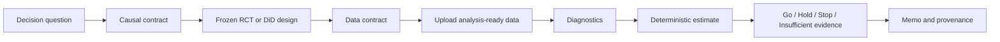

# Causal Decision Agent

An evidence-first workbench that turns a business question into a reproducible
causal decision. It supports the complete lifecycle on both sides of data
collection: design the study before launch, then audit and analyze the evidence
after results arrive.

The product is deliberately domain-neutral. Product onboarding and game server
rollouts are included as concrete templates, not as hard-coded verticals.

## The workflow



There are two honest entry points:

- **Plan a new study** freezes the hypothesis, estimand, metrics, sample size,
  diagnostics, and decision thresholds before outcomes are observed.
- **Analyze existing data** creates a retrospective contract and labels it as
  such. It never presents a post-hoc plan as preregistration.

See [the architecture note](docs/architecture.md) for the responsibility split
and full lifecycle.

## Supported golden paths

| Design | Before the study | After the study |
| --- | --- | --- |
| Randomized A/B | binary or continuous power, unequal allocation, duration, guardrails, optional CUPED plan | schema and unit-grain validation, SRM, binary/continuous estimates, CUPED, confidence intervals, frozen decision rules |
| Difference-in-Differences | ATT contract, intervention boundary, minimum pre-periods, data grain, guardrails | unit/time fixed effects, unit-clustered uncertainty, event study, joint pre-trend gate, frozen decision rules |

Study analysis accepts analysis-ready CSV or Parquet files. Required columns are
declared before upload. Missing required values, duplicate grain, treatment-label
drift, and other risky problems are reported rather than silently cleaned.

## Agent versus statistics

The intake Agent is a bounded, human-approved workflow rather than an
unconstrained chatbot. DeepSeek interprets each answer and returns a validated
JSON message plus optional interactive form fields. The server independently
checks contract completeness before allowing a freeze. All effects, uncertainty
intervals, p-values, diagnostics, and decisions are still produced by
deterministic Python code; an LLM is not required for the verified demo.

The first intake form is application-owned and always collects both the business
question and hypothesis. Values submitted through any generated form are merged
by field ID before DeepSeek plans the next question, so confirmed numbers are not
re-extracted from display text. If a model response violates the form schema, the
server preserves confirmed values and returns a deterministic recovery form.
Guardrails are collected in ordinary language; DeepSeek converts them to structured
rules, and the server still validates the resulting metric, direction, and tolerance.

Each analysis persists:

- the immutable design hash and causal/data contracts;
- an order-insensitive dataset snapshot hash plus the raw upload SHA-256;
- explicit transformation lineage;
- diagnostics, estimates, decision rationale, and agent trace;
- an immutable run record, while the source dataset itself is not retained.

## Stack

- FastAPI, Pydantic, SQLModel, pandas, NumPy, and SciPy
- Next.js 16, React 19, TypeScript, Tailwind CSS, and Recharts
- SQLite locally or PostgreSQL through `DATABASE_URL`
- Vercel frontend and Render-compatible backend deployment

## Local setup

Prerequisites: Python 3.10+ and Node.js 22+.

```bash
python -m venv .venv
source .venv/bin/activate
pip install -e ".[dev]"

cd frontend
npm ci
cd ..
```

Start the backend:

```bash
uvicorn backend.main:app --reload --port 8000
```

Start the frontend in another terminal:

```bash
cd frontend
NEXT_PUBLIC_API_URL=http://localhost:8000 npm run dev
```

Open [http://localhost:3000](http://localhost:3000). The verified RCT path is
also available through `GET /api/studies/demo/rct`.

### DeepSeek study Agent

Opening `/studies/new` without a configured key shows a DeepSeek setup dialog.
The same controls are available from `/settings`. The default model is
`deepseek-v4-pro`; `deepseek-v4-flash` is available as a lower-latency option.

By default, the key is stored only in browser session storage. Selecting
**Remember on this device** opts into browser local storage. The key is sent only
in the dedicated Agent request header, is not written to the study database, and
the backend fixes the provider host to `https://api.deepseek.com` rather than
accepting an arbitrary URL.

The backend can also use `DEEPSEEK_API_KEY` for direct API clients. Browser users
still configure their personal key through the dialog or Settings page.

### Conversation history and storage

Every new conversation receives a stable `conv_…` identifier. The workbench
keeps that identifier in the URL, so a history item can restore its messages,
forms, tool events, frozen study reference, and latest resumable workflow state.

Conversation state always goes through the backend persistence API:

- local development uses `local.db` through the default SQLite
  `DATABASE_URL`;
- production should set `DATABASE_URL` to a persistent managed PostgreSQL
  database (for example, the database attached to the Render service);
- ephemeral container SQLite is not a production history store because it can
  disappear when an instance is replaced or redeployed.

Until account authentication is added, the browser creates an anonymous
workspace key in local storage and the backend stores only its SHA-256 hash.
That key scopes which conversation IDs the browser may list or restore. Clearing
site storage therefore disconnects that browser from its anonymous history.
The DeepSeek key and uploaded dataset rows are never saved in conversation
snapshots. In a multi-user deployment, the same API can be retained while the
anonymous workspace hash is replaced with the authenticated user or workspace
identifier.

### Optional legacy explanatory API

To enable the older explanatory endpoints, configure the backend process:

```env
OPENAI_API_KEY=...
OPENAI_MODEL=deepseek-v4-pro
OPENAI_BASE_URL=https://api.deepseek.com
ENABLE_LEGACY_API=true
```

The deployment, not an HTTP request, owns the provider base URL. This prevents a
request from redirecting the server API key to an arbitrary host. Legacy routes
are disabled by default so the primary lifecycle starts without RAG or LLM
initialization.

## API surface

| Endpoint | Purpose |
| --- | --- |
| `GET /api/agent/config` | report the available DeepSeek Agent models without exposing credentials |
| `POST /api/agent/intake` | analyze conversation history and return a validated message/form response |
| `POST /api/conversations` | create a conversation and its stable history key |
| `GET /api/conversations` | list recent conversations for the current workspace |
| `GET /api/conversations/{id}` | restore one persisted conversation snapshot |
| `PUT /api/conversations/{id}` | update submitted messages, tool events, and workflow state |
| `DELETE /api/conversations/{id}` | delete one workspace-owned conversation |
| `POST /api/studies/design` | validate and freeze a `StudyDesignRequest` |
| `GET /api/studies` | list persisted studies |
| `GET /api/studies/{id}` | retrieve contracts, latest result, and run history |
| `POST /api/studies/{id}/analyze` | analyze a CSV/Parquet upload against the frozen contract |
| `GET /api/studies/{id}/artifact` | download the frozen design JSON |
| `GET /api/studies/{id}/memo` | download the deterministic decision memo |
| `GET /api/studies/demo/rct` | run or retrieve the deterministic verified demo |
| `GET /health` | process liveness |
| `GET /ready` | initialization and database readiness |

The OpenAPI schema is available at `/docs` while the backend is running.

## Docker

```bash
NEXT_PUBLIC_API_URL=http://localhost:8000 docker compose up --build
```

`NEXT_PUBLIC_API_URL` is embedded into the browser bundle during the frontend
build. Set it to the publicly reachable backend URL for deployment.

Render's free instance may take about two minutes to wake after inactivity. The
web client treats that period as **warming**, polls `/ready`, and only reports a
failure after the bounded readiness window expires.

For a native Render Python service, use `pip install -r backend/requirements.txt`
as the build command and `uvicorn backend.main:app --host 0.0.0.0 --port $PORT`
as the start command. Point its health check at `/health`; the application uses
`/ready` separately for database-aware readiness.

## Repository structure

```text
backend/
  main.py                  FastAPI lifecycle, CORS, liveness, readiness
  conversations.py         workspace-scoped conversation history API
  studies.py               study API, upload boundary, persistence adapter
  models.py                conversation, study, and immutable run records
frontend/
  app/                     lifecycle workbench and study routes
  components/              conversation, readiness, and evidence UI
src/causal_agent/
  lifecycle/
    schemas.py             strict and frozen domain contracts
    design.py              deterministic pre-study compiler
    analysis.py            RCT/DiD diagnostics, estimators, decisions
tests/
  test_lifecycle.py        deterministic statistical fixtures
  test_studies_api.py      API and provenance integration tests
```

## Roadmap

Priority is depth and credibility, not a long menu of shallow estimators.
The full prioritization and success criteria live in
[docs/roadmap.md](docs/roadmap.md).

1. Add an explicit data-profile and transformation-confirmation step, plus
   downloadable decision memos and design artifacts.
2. Add sensitivity and falsification checks: placebo dates, robustness windows,
   attrition/missingness policies, and multiple-testing policy.
3. Add an evaluation harness for agent routing and explanations, with numerical
   faithfulness checks against the deterministic result object.
4. Expand methods only with a complete contract, diagnostics, simulations, and
   failure-case fixtures—for example regression discontinuity or doubly robust
   observational estimation.

## License

[MIT](LICENSE)
