# Causal Decision Agent architecture

## Product boundary

Causal Decision Agent is a domain-neutral workbench for turning a decision
question into a reproducible causal study. It supports both prospective study
design and retrospective analysis, with RCT and Difference-in-Differences as the
first production-quality methods.

The intake Agent uses DeepSeek to interpret free-text and structured form
answers, while a server-owned protocol constrains the fields it can return and
independently checks contract completeness. Explicit human approval is required
before the identification strategy is frozen. Numeric results come from
deterministic Python estimators and are never invented by an LLM. Every result
remains linked to a frozen design artifact, a dataset hash, diagnostics,
assumptions, and a decision rule.

## Primary lifecycle

```mermaid
flowchart LR
    A["Decision question"] --> B["Causal contract"]
    B --> C{"Study entry"}
    C -->|"Plan new study"| D["RCT or DiD design"]
    C -->|"Analyze existing data"| E["Retrospective contract"]
    D --> F["Frozen DesignSpec"]
    E --> F
    F --> G["DataContract"]
    G --> H["Execute outside the tool"]
    H --> I["Upload CSV or Parquet"]
    I --> J["Profile and propose cleaning"]
    J --> K["Human confirms plan"]
    K --> Q["Deterministic cleaning on a copy"]
    Q --> R{"Diagnostics credible?"}
    R -->|"No"| L["Insufficient evidence / redesign"]
    R -->|"Yes"| M["Deterministic estimate"]
    M --> N["Critic and decision rules"]
    N --> S["Adjusted drilldowns and consistency"]
    S --> O{"Go / Hold / Stop"}
    O --> P["Interactive report and provenance"]
    L --> P
```

## Responsibility split

| Layer | Responsibilities | Must not do |
| --- | --- | --- |
| Agent workflow | clarify the question, construct the contract, select a supported design, propose allow-listed cleaning, route checks, explain results | fabricate an effect, p-value, confidence interval, diagnostic, or silently execute cleaning |
| Deterministic core | confirmed cleaning, power, SRM, effect estimation, CUPED, fixed-effects DiD, clustered errors, pre-trend checks, subgroup consistency, decision rules | silently reinterpret columns, impute primary outcomes, or repair unresolved grain conflicts |
| API and persistence | validate Agent JSON, restrict DeepSeek requests to the official host, validate uploads, freeze artifacts, hash datasets, persist runs, expose health/readiness | persist API keys, log API keys, or accept an arbitrary model endpoint |
| Web workbench | guide the lifecycle, render Agent-provided form controls, show assumptions and provenance, keep cold-start state honest | treat unconfirmed defaults as user answers or treat a slow free backend as a failed analysis |

## Supported contracts

### Randomized controlled trial

Required analysis data contains a stable unit identifier, treatment assignment,
the declared primary outcome, all declared guardrails, and any pre-period CUPED
covariates. The profiler proposes explicit handling for safe, detectable issues
such as exact duplicates, whitespace, missing required values, and invalid metrics.
After human confirmation, the analyzer applies the plan to a copy, validates
allocation, grain, support, sample-ratio mismatch, and outcome type, then estimates
overall and selected low-cardinality subgroup effects.

### Difference-in-Differences

Required analysis data contains a stable unit identifier, time, treatment-group
membership, the intervention boundary, the declared outcome, and guardrails.
The analyzer requires multiple pre-periods, estimates unit and time fixed effects
with clustered uncertainty, and reports a pre-trend/event-study diagnostic before
allowing an affirmative decision. Drilldowns are limited to dimensions that are
stable within units.

## Persistence model

- `StudyRecord` stores the frozen design artifact and latest analysis result.
- `StudyRunRecord` stores one immutable run, including filename, dataset SHA-256,
  row count, result, and timestamp.
- Source data is processed in memory and is not retained by the application in
  the current MVP.

## Deployment behavior

`/health` is a liveness probe. `/ready` verifies initialization and database
access. The web client polls readiness for up to two minutes because the Render
free instance can legitimately cold-start during that window.
